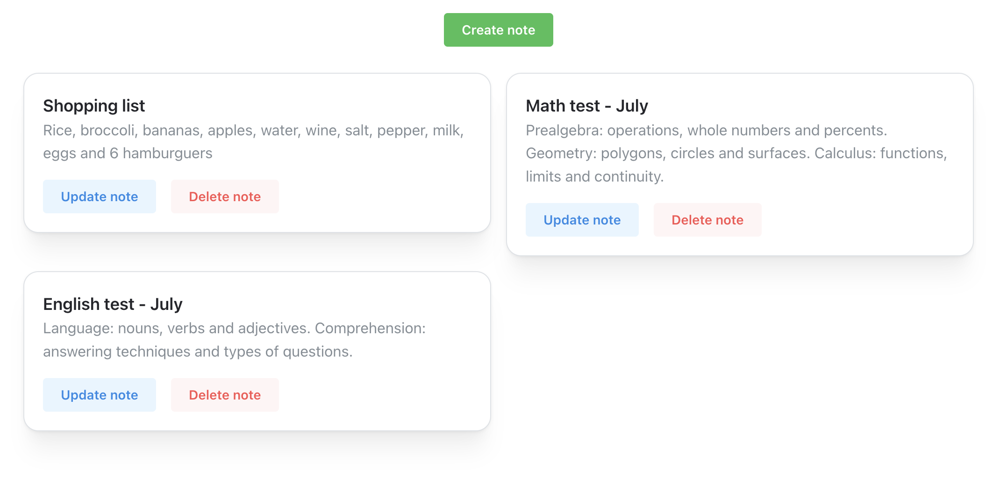
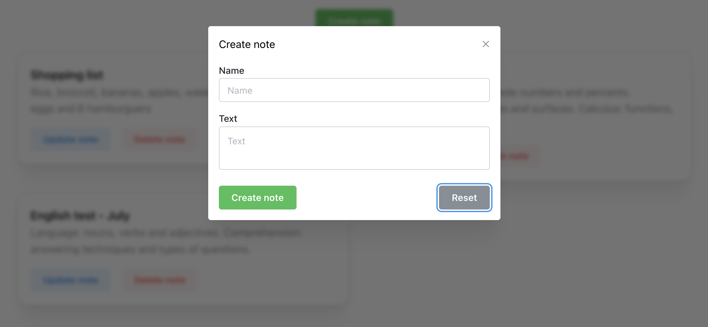
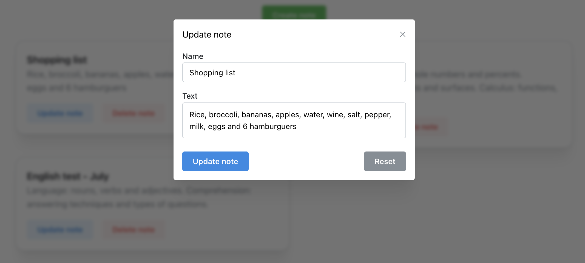
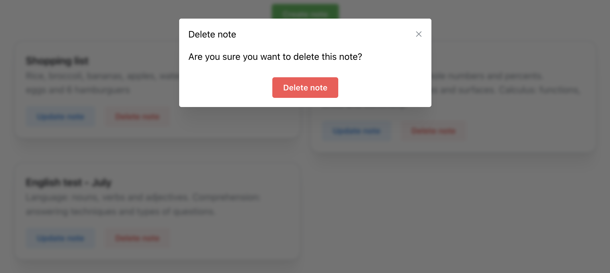

# Notes

A simple note-taking application. The client was built with React and typescript and there are two different servers (both with the same functionality), one built with .NET and C# and another using Spring and Java.

To run the application you can run docker compose up and go to http://localhost:5070.

